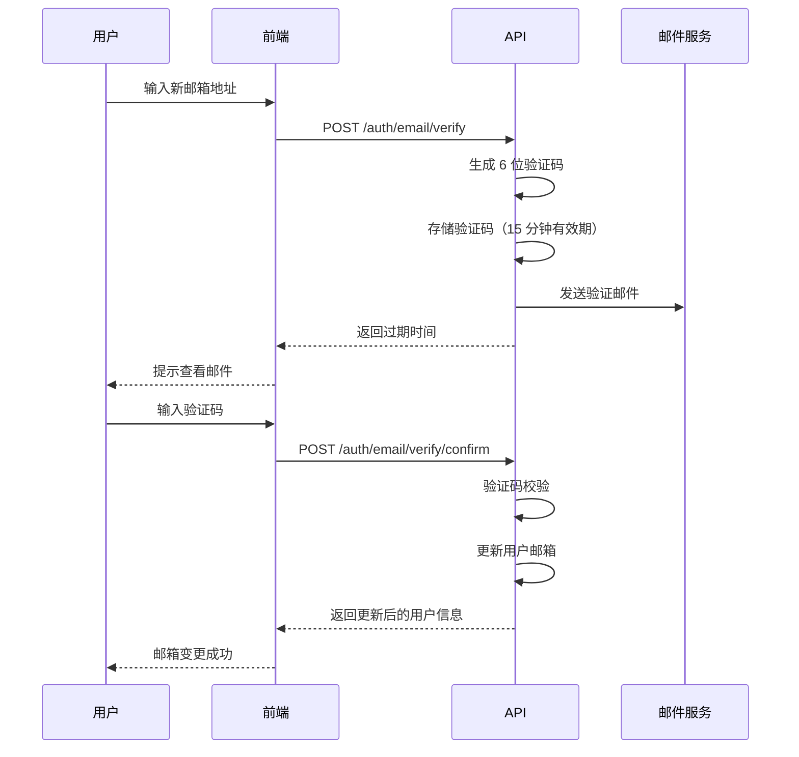
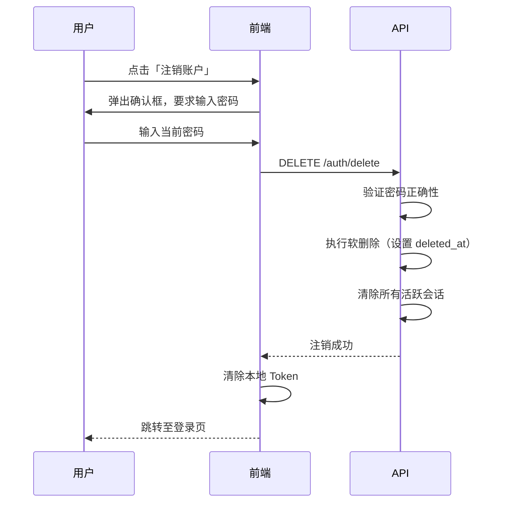
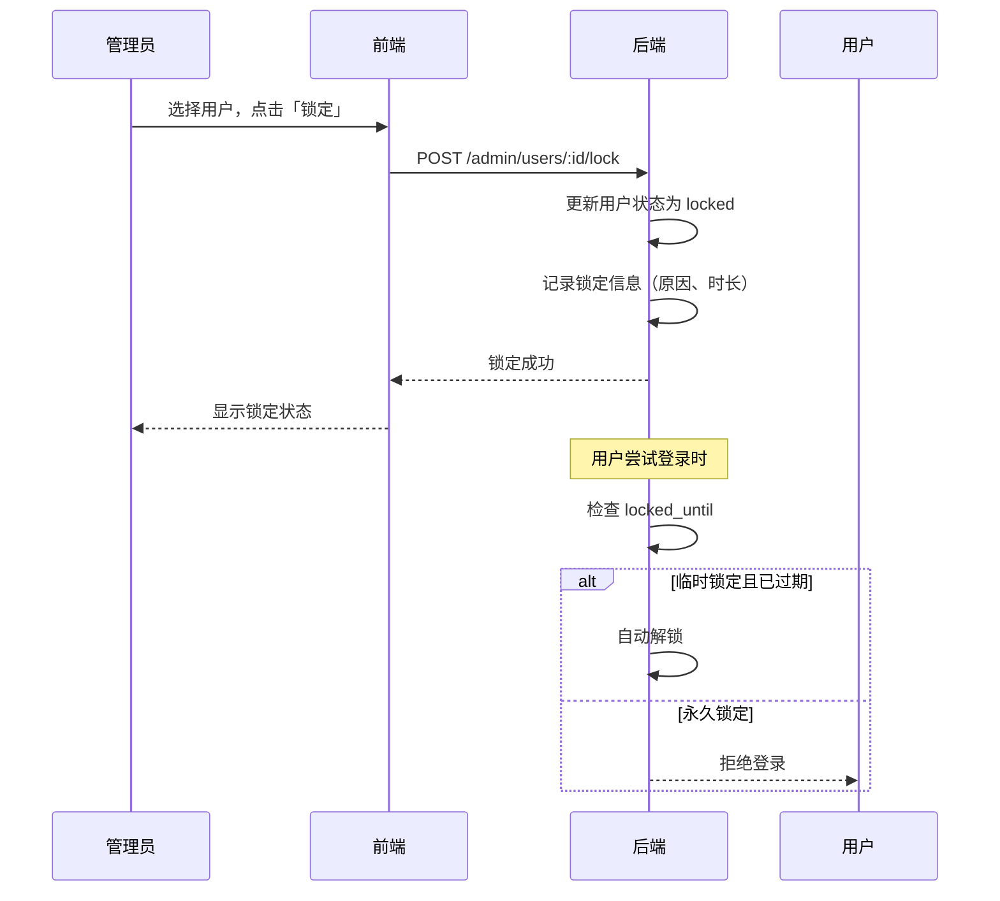

# 后端待实现 API

> 本文档记录前端已完成但后端尚未实现的 API 功能
> 请后端团队按照本文档补充实现

---

## 文档说明

本文档按模块组织，每个模块包含：
- **功能概述**：为什么需要这个功能
- **业务逻辑**：详细的实现说明
- **API 端点**：请求/响应格式
- **数据库变更**：如需要
- **影响范围**：前端哪些功能受影响

---

## Auth/User 模块

### 1. 邮箱验证

#### 功能概述

用户更换邮箱时，需要发送验证码到新邮箱进行确认，确保邮箱所有权。

#### 业务场景



#### API 端点

##### 1.1 发送邮箱验证码

**端点**：`POST /auth/email/verify`

**权限**：需要认证

**请求格式**：
```typescript
interface SendEmailVerificationDto {
  new_email: string;  // 新邮箱地址
}
```

**响应格式**：
```typescript
interface ApiResponse {
  code: number;
  message: string;
  data: {
    expires_in: number;  // 验证码有效期（秒）
  };
}
```

**响应示例**：
```json
{
  "code": 0,
  "message": "验证码已发送",
  "data": {
    "expires_in": 900
  }
}
```

**业务规则**：
- 验证码有效期：**15 分钟**（900 秒）
- 验证码长度：**6 位数字**
- 防止滥用：同一邮箱 **60 秒内**只能发送一次
- 验证码应存储在缓存中（如 Redis），格式：`email_verify:{user_id}:{new_email}`

**错误码**：
| 错误码 | HTTP 状态 | 说明 |
|--------|-----------|------|
| 400001 | 400 | 邮箱格式不正确 |
| 400002 | 400 | 新邮箱与当前邮箱相同 |
| 400003 | 429 | 发送过于频繁，60 秒后重试 |
| 400004 | 400 | 邮箱已被其他用户使用 |

---

##### 1.2 确认邮箱变更

**端点**：`POST /auth/email/verify/confirm`

**权限**：需要认证

**请求格式**：
```typescript
interface ConfirmEmailDto {
  verification_code: string;  // 6 位验证码
  new_email: string;          // 新邮箱地址
}
```

**响应格式**：
```typescript
interface ApiResponse {
  code: number;
  message: string;
  data: {
    user: User;  // 更新后的用户信息
  };
}
```

**响应示例**：
```json
{
  "code": 0,
  "message": "邮箱变更成功",
  "data": {
    "user": {
      "id": "user_123",
      "username": "test_user",
      "email": "new@example.com",
      "role": "user",
      "avatar": "https://cdn.example.com/avatar/user_123.webp",
      "created_at": "2025-01-01T00:00:00Z",
      "updated_at": "2025-02-26T10:30:00Z"
    }
  }
}
```

**业务规则**：
- 验证码正确且未过期 → 更新用户邮箱
- 验证后清除缓存中的验证码
- 记录邮箱变更日志（可选）

**错误码**：
| 错误码 | HTTP 状态 | 说明 |
|--------|-----------|------|
| 400005 | 400 | 验证码不正确 |
| 400006 | 400 | 验证码已过期 |
| 400007 | 400 | 验证码与邮箱不匹配 |
| 400008 | 400 | 邮箱已被其他用户使用 |

---

#### 数据库变更

**可能需要新增的表**（视现有架构而定）：

```sql
-- 邮箱变更历史表（可选，用于审计）
CREATE TABLE email_change_history (
    id VARCHAR(36) PRIMARY KEY,
    user_id VARCHAR(36) NOT NULL,
    old_email VARCHAR(255) NOT NULL,
    new_email VARCHAR(255) NOT NULL,
    changed_at TIMESTAMP DEFAULT CURRENT_TIMESTAMP,
    ip_address VARCHAR(45),
    INDEX idx_user_id (user_id)
);
```

---

#### 影响范围

| 前端功能 | 文件位置 | 影响描述 |
|----------|----------|----------|
| 邮箱设置 | `src/pages/Settings/index.tsx` | 调用发送验证码和确认邮箱 API |
| 类型定义 | `src/types/api/auth.ts` | `SendEmailVerificationDto`、`ConfirmEmailDto` |
| 服务调用 | `src/services/auth.ts` | `sendEmailVerification`、`confirmEmail` |

---

### 2. 头像上传

#### 功能概述

用户可以上传头像图片，系统自动压缩并转换为 WebP 格式以优化存储和加载性能。

#### 当前状态

后端当前返回 501 错误：
```
ErrorResponse(c, 501, "direct file upload not implemented, please use avatar_url field")
```

#### 需要实现的配置

```yaml
avatar:
  max_size: 2MB                 # 最大文件大小
  allowed_formats:
    - jpeg
    - jpg
    - png
    - webp
  min_width: 100                # 最小宽度（像素）
  min_height: 100               # 最小高度（像素）
  max_width: 2000               # 最大宽度（像素）
  max_height: 2000              # 最大高度（像素）
  resize_to_fit: true           # 是否缩放到限制范围内
  output_format: webp           # 输出格式
  output_quality: 85            # 输出质量 (1-100)
  thumbnail_size: 128           # 缩略图尺寸（可选）
```

#### API 端点

##### 2.1 上传头像

**端点**：`POST /auth/avatar`

**权限**：需要认证

**请求格式**：`multipart/form-data`
- `avatar`: File (图片文件)

**响应格式**：
```typescript
interface ApiResponse {
  code: number;
  message: string;
  data: AvatarResponse;
}

interface AvatarResponse {
  avatar: string;  // 头像 URL
}
```

**响应示例**：
```json
{
  "code": 0,
  "message": "头像上传成功",
  "data": {
    "avatar": "https://cdn.example.com/avatars/user_123.webp?v=1740556800"
  }
}
```

**业务规则**：
1. **文件验证**：
   - 检查文件类型（MIME type + 文件头）
   - 检查文件大小（不超过 2MB）
   - 检查图片尺寸（100x100 ~ 2000x2000）

2. **图片处理**：
   - 如果尺寸超过最大值，等比缩放至限制范围内
   - 转换为 WebP 格式，质量 85
   - 生成缩略图（可选，128x128）

3. **存储**：
   - 文件命名：`{user_id}.webp`
   - 添加版本参数（时间戳）用于 CDN 缓存刷新
   - 建议使用对象存储（如 S3、OSS）

**错误码**：
| 错误码 | HTTP 状态 | 说明 |
|--------|-----------|------|
| 400010 | 400 | 文件过大（超过 2MB） |
| 400011 | 400 | 格式不支持（仅支持 JPG/PNG/WebP） |
| 400012 | 400 | 图片尺寸不符合要求 |
| 400013 | 400 | 文件损坏或不是有效图片 |
| 500001 | 500 | 存储服务异常 |

---

#### 数据库变更

无需额外表变更，头像 URL 存储在 `users` 表的 `avatar` 字段。

---

#### 影响范围

| 前端功能 | 文件位置 | 影响描述 |
|----------|----------|----------|
| 用户资料 | `src/pages/Settings/index.tsx` | 调用上传头像 API |
| 类型定义 | `src/types/api/auth.ts` | `AvatarResponse` |
| 服务调用 | `src/services/auth.ts` | `updateAvatar` |

---

### 3. 账户注销

#### 功能概述

用户可以注销账户，数据软删除，30 天冷却期内可恢复。此操作需要密码验证以确保账户安全。

#### 业务场景



#### API 端点

##### 3.1 注销账户

**端点**：`DELETE /auth/delete`

**权限**：需要认证

**请求格式**：
```typescript
interface DeleteAccountDto {
  password: string;  // 当前密码，用于确认身份
}
```

**响应格式**：
```typescript
interface ApiResponse {
  code: number;
  message: string;
  data: {
    deleted_at: string;      // 注销时间
    recoverable_until: string;  // 可恢复截止时间
  };
}
```

**响应示例**：
```json
{
  "code": 0,
  "message": "账户已注销，30 天内可联系客服恢复",
  "data": {
    "deleted_at": "2025-02-26T10:30:00Z",
    "recoverable_until": "2025-03-28T10:30:00Z"
  }
}
```

**业务规则**：
1. **密码验证**：
   - 必须验证当前密码正确性
   - 密码错误返回 `400020`

2. **软删除机制**：
   - 设置 `deleted_at` 字段为当前时间
   - 设置 `status = 'deleted'`
   - **不删除**用户数据，仅标记为已删除

3. **会话处理**：
   - 清除所有活跃的 refresh token
   - 使当前 access_token 立即失效

4. **冷却期**：
   - 30 天冷却期（可配置）
   - 冷却期内用户可联系客服恢复账户
   - 冷却期后永久删除数据（通过定时任务）

**错误码**：
| 错误码 | HTTP 状态 | 说明 |
|--------|-----------|------|
| 400020 | 400 | 密码不正确 |
| 400021 | 400 | 账户已被注销 |
| 400022 | 400 | 账户已被锁定，无法注销 |
| 403001 | 403 | 权限不足 |

---

#### 数据库变更

**可能需要添加的字段**（如果不存在）：

```sql
-- 用户表添加软删除字段
ALTER TABLE users ADD COLUMN IF NOT EXISTS deleted_at TIMESTAMP NULL;
ALTER TABLE users ADD COLUMN IF NOT EXISTS deleted_reason VARCHAR(255);

-- 添加索引便于查询待删除账户
CREATE INDEX idx_deleted_at ON users(deleted_at) WHERE deleted_at IS NOT NULL;
```

**定时任务**（建议）：

```sql
-- 定期清理超过冷却期的账户（如每天凌晨执行）
DELETE FROM users
WHERE deleted_at IS NOT NULL
  AND deleted_at < NOW() - INTERVAL '30 days';
```

---

#### 影响范围

| 前端功能 | 文件位置 | 影响描述 |
|----------|----------|----------|
| 账户注销 | `src/pages/Settings/index.tsx` | 调用注销账户 API |
| 类型定义 | `src/types/api/auth.ts` | `DeleteAccountDto` |
| 服务调用 | `src/services/auth.ts` | `deleteAccount` |

---

### 4. 用户锁定

#### 功能概述

管理员可以锁定用户账号，支持临时锁定和永久锁定。锁定后的用户无法登录系统。

#### 业务场景



#### API 端点

##### 4.1 锁定用户

**端点**：`POST /admin/users/:id/lock`

**权限**：需要管理员权限

**请求格式**：
```typescript
interface LockUserDto {
  reason: string;          // 锁定原因
  duration_hours?: number; // 锁定时长（小时），为空表示永久锁定
}
```

**响应格式**：
```typescript
interface ApiResponse {
  code: number;
  message: string;
  data: {
    user: User;
    locked_until?: string;  // 锁定截止时间（临时锁定时返回）
  };
}
```

**响应示例**：

永久锁定：
```json
{
  "code": 0,
  "message": "用户已被永久锁定",
  "data": {
    "user": {
      "id": "user_123",
      "username": "test_user",
      "status": "locked"
    }
  }
}
```

临时锁定：
```json
{
  "code": 0,
  "message": "用户已被锁定 24 小时",
  "data": {
    "user": {
      "id": "user_123",
      "username": "test_user",
      "status": "locked"
    },
    "locked_until": "2025-02-27T10:30:00Z"
  }
}
```

**业务规则**：
- `duration_hours` 为 **空、null 或 undefined**：表示**永久锁定**
- `duration_hours` 为数字：锁定指定小时数
- 锁定后用户状态变为 `locked`
- 登录时需检查 `locked_until`，如已过期则自动解锁

**错误码**：
| 错误码 | HTTP 状态 | 说明 |
|--------|-----------|------|
| 404001 | 404 | 用户不存在 |
| 400030 | 400 | 用户已被锁定 |
| 403001 | 403 | 权限不足（非管理员） |

---

##### 4.2 解锁用户

**端点**：`POST /admin/users/:id/unlock`

**权限**：需要管理员权限

**请求格式**：无（或空 JSON `{}`）

**响应格式**：
```typescript
interface ApiResponse {
  code: number;
  message: string;
  data: {
    user: User;
  };
}
```

**响应示例**：
```json
{
  "code": 0,
  "message": "用户已解锁",
  "data": {
    "user": {
      "id": "user_123",
      "username": "test_user",
      "status": "active"
    }
  }
}
```

**业务规则**：
- 清除 `locked_until` 字段
- 恢复用户状态为 `active`

---

#### 数据库变更

**可能需要添加的字段**（如果不存在）：

```sql
-- 用户表添加锁定相关字段
ALTER TABLE users ADD COLUMN IF NOT EXISTS locked_until TIMESTAMP NULL;
ALTER TABLE users ADD COLUMN IF NOT EXISTS locked_reason VARCHAR(255);
ALTER TABLE users ADD COLUMN IF NOT EXISTS locked_by VARCHAR(36);  -- 锁定操作人

-- 添加索引便于查询锁定用户
CREATE INDEX idx_locked_until ON users(locked_until) WHERE locked_until IS NOT NULL;
```

---

#### 影响范围

| 前端功能 | 文件位置 | 影响描述 |
|----------|----------|----------|
| 用户管理 | `src/pages/admin/Users/index.tsx` | 调用锁定/解锁 API |
| 类型定义 | `src/types/api/auth.ts` | `LockUserDto` |
| 服务调用 | `src/services/auth.ts` | `lockUser`、`unlockUser` |

---

## API 端点汇总

| 方法 | 端点 | 说明 | 优先级 |
|------|------|------|--------|
| POST | `/auth/email/verify` | 发送邮箱验证码 | P1 |
| POST | `/auth/email/verify/confirm` | 确认邮箱变更 | P1 |
| POST | `/auth/avatar` | 上传头像 | P1 |
| DELETE | `/auth/delete` | 注销账户 | P2 |
| POST | `/admin/users/:id/lock` | 锁定用户 | P2 |
| POST | `/admin/users/:id/unlock` | 解锁用户 | P2 |

---

## 实现优先级建议

1. **P1（高优先级）**：
   - `POST /auth/avatar` - 头像上传是基础功能
   - `POST /auth/email/verify` + `POST /auth/email/verify/confirm` - 邮箱变更是安全相关功能

2. **P2（中优先级）**：
   - `DELETE /auth/delete` - 账户注销是合规要求
   - `POST /admin/users/:id/lock` + `unlock` - 用户锁定是管理功能

---

## 附录：现有已完成 API 端点

以下端点前端已对接，后端应该已实现（如有问题请核实）：

| 方法 | 端点 | 说明 |
|------|------|------|
| POST | `/auth/login` | 用户登录 |
| POST | `/auth/register` | 用户注册 |
| GET | `/auth/me` | 获取当前用户 |
| POST | `/auth/refresh` | 刷新 Token |
| POST | `/auth/logout` | 用户登出 |
| PUT | `/auth/password` | 修改密码 |
| PATCH | `/auth/profile` | 更新用户资料 |
| POST | `/auth/password/reset` | 发送密码重置邮件 |
| POST | `/auth/password/reset/confirm` | 重置密码 |
| GET | `/admin/users` | 获取用户列表 |
| GET | `/admin/users/:id` | 获取用户详情 |
| PUT | `/admin/users/:id/role` | 更新用户角色 |
| DELETE | `/admin/users/:id` | 删除用户（管理员） |

---

## 前端类型定义引用

完整的类型定义位于：
- `src/types/api/auth.ts` - Auth 相关 API 类型
- `src/types/user.ts` - 用户实体类型

---

## 联系方式

如有疑问，请联系前端开发团队。
