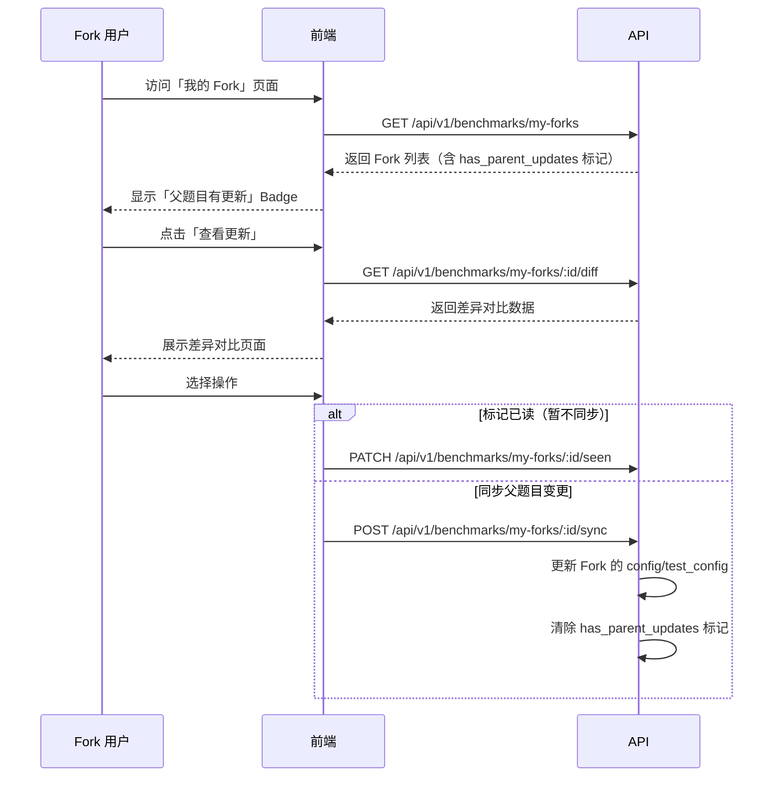
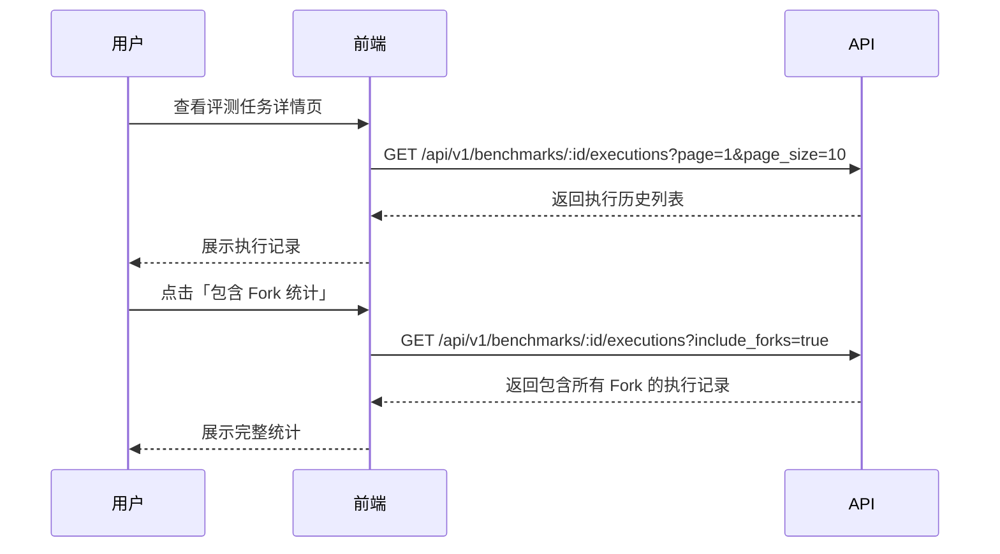

# 后端待实现 API

> 本文档记录前端已完成但后端尚未实现的 API 功能
> 请后端团队按照本文档补充实现

---

## 文档说明

本文档按模块组织，每个模块包含：
- **功能概述**：为什么需要这个功能
- **业务逻辑**：详细的实现说明
- **API 端点**：请求/响应格式
- **数据库变更**：如需要
- **影响范围**：前端哪些功能受影响

---

## Benchmark 模块

### 1. Fork 差异对比

#### 功能概述

当用户 Fork 的评测任务的父题目有更新时，用户需要查看父题目与自己的 Fork 之间有什么差异，然后决定是否同步更新。

#### 业务场景



#### API 端点

##### 1.1 获取 Fork 差异

**端点**：`GET /api/v1/benchmarks/my-forks/:id/diff`

**权限**：需要认证 + 组织上下文，仅 Fork 创建者可访问

**请求参数**：
- `id`: Fork 记录 ID（BenchmarkFork 表的 ID，非 Benchmark ID）

**响应格式**：
```typescript
interface ForkDiffResponse {
  // Fork 关系信息
  fork_id: string;              // Fork 记录 ID
  fork_child_id: string;        // Fork 后的题目 ID（当前用户的题目）
  fork_parent_id: string;       // 父题目 ID
  fork_child_name: string;      // Fork 题目名称
  fork_parent_name: string;     // 父题目名称

  // 版本信息
  parent_version: number;       // Fork 时父题目的版本号
  parent_updated_at: string;    // Fork 时父题目的更新时间
  current_parent_version: number; // 父题目当前版本号
  current_parent_updated_at: string; // 父题目当前更新时间

  // 变更状态
  has_parent_changes: boolean;  // 父题目是否有更新
  has_fork_changes: boolean;    // Fork 后用户是否也修改过
  can_auto_sync: boolean;       // 是否可自动同步（用户未修改过）

  // 差异详情
  diff: {
    // 基础字段差异
    name?: DiffResult<string>;
    display_name?: DiffResult<string>;
    description?: DiffResult<string>;

    // 配置差异（JSON diff）
    config?: DiffResult<Record<string, any>>;
    test_config?: DiffResult<Record<string, any>>;

    // 元数据差异
    metadata?: DiffResult<Record<string, any>>;
  };
}

// 差异结果
interface DiffResult<T> {
  old: T;       // Fork 时的值（父题目）
  new: T;       // 父题目当前的值
  changed: boolean; // 是否有变化
}

// 统一响应格式
interface ApiResponse<T> {
  code: number;
  message: string;
  data: T;
}
```

**响应示例**：
```json
{
  "code": 0,
  "message": "success",
  "data": {
    "fork_id": "fork_123",
    "fork_child_id": "bench_456",
    "fork_parent_id": "bench_789",
    "fork_child_name": "python-basics-fork",
    "fork_parent_name": "python-basics",
    "parent_version": 1,
    "current_parent_version": 2,
    "has_parent_changes": true,
    "has_fork_changes": false,
    "can_auto_sync": true,
    "diff": {
      "description": {
        "old": "Python 基础练习",
        "new": "Python 基础练习 - 更新了测试用例",
        "changed": true
      },
      "config": {
        "old": { "timeout": 300000000, "max_attempts": 3 },
        "new": { "timeout": 600000000, "max_attempts": 5 },
        "changed": true
      }
    }
  }
}
```

**错误码**：
| 错误码 | HTTP 状态 | 说明 |
|--------|-----------|------|
| 404001 | 404 | Fork 记录不存在 |
| 403001 | 403 | 无权访问（非 Fork 创建者） |
| 200006 | 200 | 父题目不存在（已被删除） |

---

##### 1.2 标记更新已读

**端点**：`PATCH /api/v1/benchmarks/my-forks/:id/seen`

**权限**：需要认证 + 组织上下文，仅 Fork 创建者可操作

**请求体**：无（或空 JSON `{}`）

**响应格式**：
```typescript
interface ApiResponse {
  code: number;
  message: string;
  data: {
    fork_id: string;
    parent_updates_seen: boolean;
    updated_at: string;
  };
}
```

**业务逻辑**：
- 更新 `BenchmarkFork` 表的 `parent_updates_seen = true`
- 更新 `last_check_at` 为当前时间

---

##### 1.3 同步 Fork 更新

**端点**：`POST /api/v1/benchmarks/my-forks/:id/sync`

**权限**：需要认证 + 组织上下文，仅 Fork 创建者可操作

**请求体**：
```typescript
interface SyncForkRequest {
  fields: ("config" | "test_config" | "description" | "name" | "display_name")[];
  create_backup?: boolean;  // 是否创建备份（可选，默认 false）
}
```

**响应格式**：
```typescript
interface ApiResponse {
  code: number;
  message: string;
  data: {
    fork_id: string;
    benchmark_id: string;      // 更新后的 Fork 题目 ID
    parent_version: number;    // 更新后的父版本号
    parent_updated_at: string; // 更新后的父更新时间
    synced_fields: string[];   // 实际同步的字段
  };
}
```

**业务逻辑**：
1. 验证 Fork 记录存在且用户有权限
2. 从父题目获取指定字段的当前值
3. 更新 Fork 题目的对应字段
4. 更新 `BenchmarkFork` 表：
   - `parent_version` = 父题目当前版本
   - `parent_updated_at` = 父题目当前更新时间
   - `has_parent_updates` = false
   - `parent_updates_seen` = true
5. 如 `create_backup=true`，创建备份记录（可选功能，待定）

**错误码**：
| 错误码 | HTTP 状态 | 说明 |
|--------|-----------|------|
| 404001 | 404 | Fork 记录不存在 |
| 403001 | 403 | 无权访问（非 Fork 创建者） |
| 200007 | 200 | Fork 后用户已修改该字段，无法自动同步 |
| 200008 | 200 | 父题目不存在（已被删除） |

---

#### 数据库变更

**可能需要新增的表/字段**（视现有架构而定）：

```sql
-- BenchmarkFork 表可能需要添加字段（如果不存在）
ALTER TABLE benchmark_forks ADD COLUMN IF NOT EXISTS last_check_at TIMESTAMP;
```

---

#### 影响范围

| 前端功能 | 影响描述 |
|----------|----------|
| `MyForksPage.tsx` | 需要添加「查看更新」按钮，调用差异 API |
| `ForkUpdateBadge.tsx` | 需要添加「同步」按钮，调用同步 API |
| 新建 `ForkDiffPage.tsx` | 展示差异对比页面 |

---

### 2. Benchmark 执行历史

#### 功能概述

在评测任务详情页展示该任务的执行历史记录，支持查看所有 Fork 的执行统计。

#### 业务场景



#### API 端点

##### 2.1 获取 Benchmark 执行历史

**端点**：`GET /api/v1/benchmarks/:id/executions`

**权限**：需要认证 + 组织上下文，组织成员可查看

**请求参数**：
| 参数 | 类型 | 默认值 | 说明 |
|------|------|--------|------|
| page | number | 1 | 页码 |
| page_size | number | 20 | 每页数量（最大 100） |
| include_forks | boolean | false | 是否包含所有 Fork 的执行记录 |
| agent_id | string | - | 按 Agent 筛选（可选） |
| status | string | - | 按状态筛选（可选） |

**响应格式**：
```typescript
interface BenchmarkExecutionsResponse {
  total: number;
  page: number;
  size: number;
  data: ExecutionRecord[];
}

interface ExecutionRecord {
  id: string;
  benchmark_id: string;        // 实际执行的题目 ID
  benchmark_name: string;       // 题目名称
  benchmark_is_fork: boolean;   // 是否为 Fork 题目
  agent_id: string;
  agent_name: string;
  status: "pending" | "running" | "success" | "failed" | "timeout" | "cancelled";
  started_at: string;           // ISO 8601
  completed_at?: string;
  duration_ms?: number;
  result?: {
    success: boolean;
    exit_code: number;
    output: string;
  };
}
```

**响应示例**：
```json
{
  "code": 0,
  "message": "success",
  "data": {
    "total": 45,
    "page": 1,
    "size": 20,
    "data": [
      {
        "id": "exec_123",
        "benchmark_id": "bench_456",
        "benchmark_name": "python-basics",
        "benchmark_is_fork": false,
        "agent_id": "agent_789",
        "agent_name": "GPT-4 Agent",
        "status": "success",
        "started_at": "2025-01-15T10:30:00Z",
        "completed_at": "2025-01-15T10:33:45Z",
        "duration_ms": 225000,
        "result": {
          "success": true,
          "exit_code": 0,
          "output": "All tests passed"
        }
      }
    ]
  }
}
```

**业务逻辑**：

1. **不包含 Fork** (`include_forks=false`)：
   - 只返回 `benchmark_id = :id` 的执行记录

2. **包含 Fork** (`include_forks=true`)：
   - 返回父题目 + 所有 Fork 题目的执行记录
   - 实现方式：查询 `BenchmarkFork` 表获取所有 `child_id`，然后合并查询

```go
// 伪代码示例
func (h *BenchmarkHandler) ListExecutions(c *gin.Context) {
    benchmarkID := c.Param("id")
    includeForks := c.DefaultQuery("include_forks", "false") == "true"

    var benchmarkIDs []string
    if includeForks {
        // 查询所有 Fork
        forks := h.forkService.ListByParentID(c, benchmarkID)
        benchmarkIDs = append([]string{benchmarkID}, forks.ChildIDs()...)
    } else {
        benchmarkIDs = []string{benchmarkID}
    }

    // 查询执行记录
    executions := h.executionService.ListByBenchmarkIDs(c, benchmarkIDs, pagination)
    c.JSON(200, envelop(executions))
}
```

#### 数据库变更

无需额外表变更，使用现有的 `Execution` 和 `BenchmarkFork` 表。

#### 影响范围

| 前端功能 | 影响描述 |
|----------|----------|
| `BenchmarkDetailPage.tsx` | 执行历史 Tab 调用此 API |
| `StatsCard.tsx` | 统计卡片可能调用此 API 获取数据 |

---

## API 端点汇总

| 方法 | 端点 | 说明 | 优先级 |
|------|------|------|--------|
| GET | `/api/v1/benchmarks/my-forks/:id/diff` | 获取 Fork 差异对比 | P1 |
| PATCH | `/api/v1/benchmarks/my-forks/:id/seen` | 标记更新已读 | P1 |
| POST | `/api/v1/benchmarks/my-forks/:id/sync` | 同步 Fork 更新 | P2 |
| GET | `/api/v1/benchmarks/:id/executions` | 获取 Benchmark 执行历史 | P1 |

---

## 实现优先级建议

1. **P1（高优先级）**：
   - `GET /api/v1/benchmarks/:id/executions` - 执行历史是详情页核心功能
   - `GET /api/v1/benchmarks/my-forks/:id/diff` + `PATCH .../seen` - Fork 差异查看是基础体验

2. **P2（中优先级）**：
   - `POST /api/v1/benchmarks/my-forks/:id/sync` - 同步功能可作为迭代优化

---

## 附录：现有 Fork 相关端点（已完成）

以下端点前端已对接，后端应该已实现（如有问题请核实）：

| 方法 | 端点 | 说明 |
|------|------|------|
| POST | `/api/v1/benchmarks/:id/fork` | Fork 题目 |
| GET | `/api/v1/benchmarks/:id/forks` | 获取指定题目的 Fork 列表 |
| GET | `/api/v1/benchmarks/my-forks` | 获取当前用户的所有 Fork |

---

## 联系方式

如有疑问，请联系前端开发团队。
